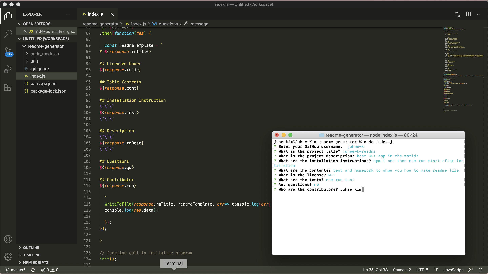

# ReadMe Generator
When user searches with city name at the lefe side bar, the current weather information which includes Current Temperature, Humidity, Wind Speed, UV Index. There will be 4 days forecast as well. 

## Link
Please see [how Readme-Generator works](https://youtu.be/zdq4m-hi71Y)!

## Screenshots

## Built with
- [npm](https://www.npmjs.com/)
- [jQuery](https://api.jquery.com/)
- [node.js](https://nodejs.org/api/fs.html)
